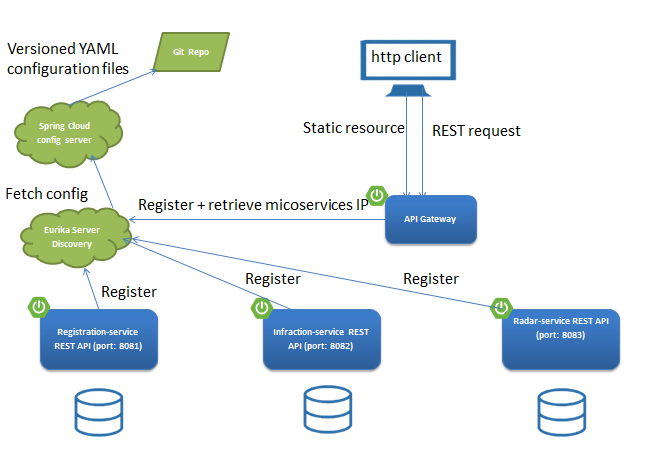
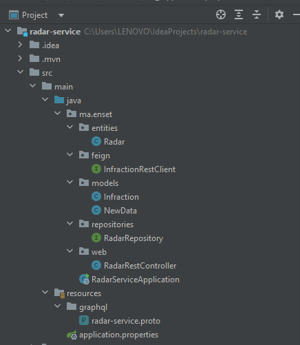
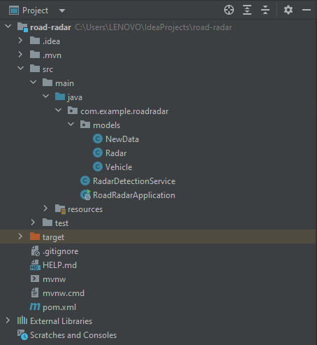
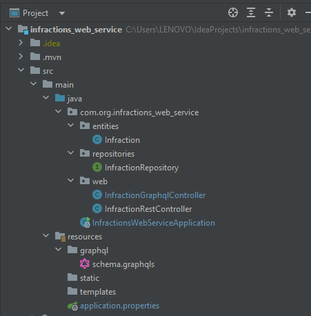

# manage-and-automate-the-process-of-handling-speed-violat-on-incidents-detected-by-automatic-radars
<h1>Table o content</h1>
<ul>
  <li><a href="#intro">Introduction</a></li>
  <li><a href="#tech">Technologies used</a></li>
  <li><a href="#archi">Technical Architecture</a></li>
  <li><a href="#diagram">Class Diagram</a></li>
  <li><a href="#part1">Part 1 : backend</a></li>
  <li><a href="#registration">Registration Service</a>
    <ul>
      <li><a href="#strReg">Structure</a></li>
       <li><a href="#postman">Test with Postman</a></li>
       <li><a href="#graphql">Test with GraphQl</a></li>
       <li><a href="#grpc">Test avec BloomGRPC </a></li>
       <li><a href="#soap">Test avec Soap</a></li>
    </ul>
  </li>
  <li><a href="#radar">Radar Service</a>
    <ul>
      <li><a href="strRadar">Structure</a></li>
    </ul>
  </li>
  <li><a href="#road">Road Radar Service</a>
  <ul>
      <li><a href="#roadStr">Structure</a></li>
    </ul>
  </li>
  <li><a href="infra">Infraction service</a>
    <ul>
      <li><a href="#infraStr">Structure</a></li>
    </ul>
  </li>
  <li><a  href="#conclusion">Conclusion</a></li>
</ul>
<h1 id="intro">Introduction</h1>

In this project, our goal is to create a distributed system based on microservices to manage and automate the process of handling speed violation incidents detected by automatic radars. The system consists of three microservices, each serving a specific purpose. 
Firstly, we have the radar management microservice. Each radar is identified by a unique ID and is associated with a maximum speed limit, as well as longitude and latitude coordinates. This microservice enables the creation, retrieval, update, and deletion of radar-related information. 
Next, we have the vehicle registration microservice, responsible for managing vehicles and their owners. Each vehicle belongs to a single owner, identified by a unique ID, name, date of birth, email, and contact number. Vehicle information includes its ID, license plate number, brand, fiscal power, and model. This microservice facilitates the management of vehicle and owner information, including creation, retrieval, update, and deletion operations. 
Lastly, we have the violation management microservice. Each violation is identified by a unique ID and includes details such as the date of the violation, the radar number that detected the speed exceeding, the vehicle's license plate number, the vehicle's speed at the time of the violation, the radar's maximum speed limit, and the fine amount. This microservice enables the creation, retrieval, and update of violations. 
In addition to the standard operations of data consultation and modification, our system allows users to report a speed violation, which will result in the creation of a new violation record. Furthermore, vehicle owners have the ability to view their associated violations, providing them with an overview of their violation history. 
By combining these three microservices, our distributed system provides a comprehensive solution for managing and automating speed violation incidents detected by automatic radars. It offers improved traceability and efficient management of these violations.

<h1 id="tech">Technologies Used</h1>

This application utilizes a combination of technologies and frameworks, including:

<ul>
  <li>Spring Boot</li>
  <li>Spring Cloud</li>
  <li>Eureka Descovery</li>
  <li>Angular</li>
  <li>Bootstrap</li>
  <li>MySQL</li>
</ul>
<h1 id="archi">Technical Architecture</h1>

<h2 id="diagram">Class Diagram</h2>

<h1 id="part1">Part 1 : backend</h1>
<h3 id="registration">Registration Service</h3>
<ul>
  <li id="strReg">Structure : </li>
  
  <li id="postman">Test with Postman</li>
  <b>Get all owners</b>
  
  
<b>Get owner by id</b>

  
  
<b>Get all Vehicles</b>

  
  <b>Get vehicle by id</b>
  
  <li id="graphql">Test with GraphQl</li>
  <b>Get All owners</b>
  
  <b>Get all Vehicles</b>
  
  <b>get Vehicle by id</b>
  
  <b>Delete Vehicle</b>
   
  <li id="grpc">Test avec BloomGRPC </li>
   <b>Add owner</b>
  
   <b>get owner by Id</b>
  
   <b>Modify an Owner</b>
  
   <b>Delete Owner</b>
  
   <b>Add Vehicle</b>
  
   <b>Get Vehicle by Id</b>
  
  <li id="soap">Test avec Soap </li> 
  <b>Le fichier WSDL</b>
  
  <b>List of Owners</b>
  
  <b>getOwnerSoap</b>
  
  <b>List of Vehicles</b>
   
</ul>
<h3 id="radar">Radar Service</h3>
<ul>
  <li id="strRadar">Structre</li>
  
</ul>
<h3 id="road">Road Radar Service</h3>
<ul>
  <li id="roadStr">Structre</li>
  
</ul>

<h3 href="infra">Infraction Service</h3>
<ul>
  <li id="infraStr">Structre</li>
  
</ul>
<h1 id="conclusion">Conclusion</h1>

In conclusion, the goal is to create a distributed system based on microservices that automates the management of speeding violations detected by automatic radars. The system comprises three microservices: radar management, vehicle registration, and infringement management. Each microservice handles specific functionalities, such as managing radar details, vehicle information, and infringement records. Additionally, the system allows for posting speeding violations and enables owners to view their respective infringements. This system provides an efficient and streamlined approach to handle the entire process of managing and automating speeding violation infractions.

